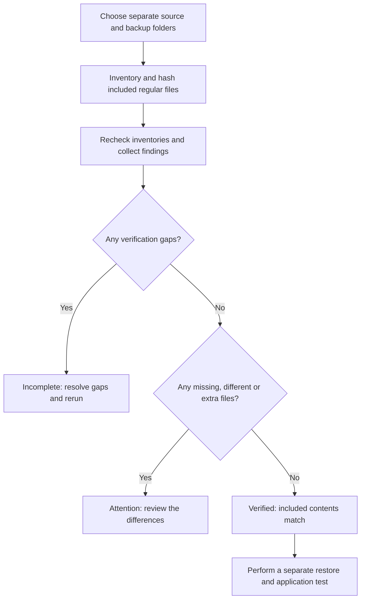

# Backup Proof

**Check whether the contents of a file-copy backup match the original files.**

A completed backup job does not tell you whether every intended file was copied correctly. Backup Proof compares file contents and explains what needs review.

[Download Windows app](https://github.com/thisisraihanm/backup-proof/releases/latest) · [Start here](START-HERE.md) · [Visual guide](docs/VISUAL-GUIDE.md) · [Technical reference](docs/TECHNICAL-REFERENCE.md)


## Try it in three steps

1. **Download and open.** On the [release page](https://github.com/thisisraihanm/backup-proof/releases/latest), download **BackupProof-Windows.zip** under Assets, choose **Extract All**, then open **BackupProof.exe**. Python is included.
2. **Try a safe example.** Click **Try a safe example**. It uses fictional data so you can learn what the results mean first.
3. **Use your own inputs.** Choose the original folder and a separate backup folder, then click **Check backup**.

The tool reads and reports; it does not repair settings or copy/delete your files. See the [beginner guide](START-HERE.md) for help opening the unsigned Windows app and choosing the right download.

## See the result before installing


*Rendered from the actual HTML report with fictional demo data. This is a report preview, not a production result or Windows desktop screenshot.*

| Example item | Result | What you are seeing |
|---|---|---|
| inventory.txt | Matching | Source and backup contain the same file contents. |
| new-config.txt | Missing | The source path has no corresponding backup file. |
| shift-notes.txt | Different | The backup contains different contents. |
| retained-notes.txt | Extra | The backup contains a file absent from the current source; it may be retained history. |

[See the detailed report image and decision flowchart →](docs/VISUAL-GUIDE.md)

## What happens inside



## Run the offline demo from source

Requires **Python 3.11+**. No pip packages are needed for the application. From this repository directory:

```sh
python backup_proof.py --demo
```

Open `reports/backup-proof.html`. The neighboring JSON file contains the detailed evidence. Exit code **1** is expected because the fictional demo deliberately includes findings.

For the source desktop interface, install Python with Tcl/Tk and open `Start-Windows.cmd` on Windows, or run `python3 desktop.py` on Linux/macOS. Windows settings collection is available only on Windows.

## Scope and evidence

Checks included regular file contents only. It does not validate permissions, application consistency, or recoverability. Busy files, unreadable data and other gaps prevent a complete verification.

- [Visual walkthrough](docs/VISUAL-GUIDE.md): architecture, decisions and report previews.
- [Lab exercise](WALKTHROUGH.md): reproduce and explain the behavior.
- [Technical reference](docs/TECHNICAL-REFERENCE.md): commands, interpretation, limitations and official references.
- [Example HTML](docs/demo-report.html) and [JSON evidence](docs/demo-report.json): fictional demonstration output. Download the HTML to view it in a browser.
- [Automated checks](https://github.com/thisisraihanm/backup-proof/actions): inspect the run and commit before drawing conclusions.

Run the existing test suite with `python -m unittest discover -s tests -v`.

## Learning focus

Filesystem administration, backup verification, SHA-256 hashing, exception handling and evidence-based reporting.

MIT licensed. Prepared with AI assistance for Raihan Mahmud's learning portfolio. No production deployment, business impact or operational recovery success is claimed.
