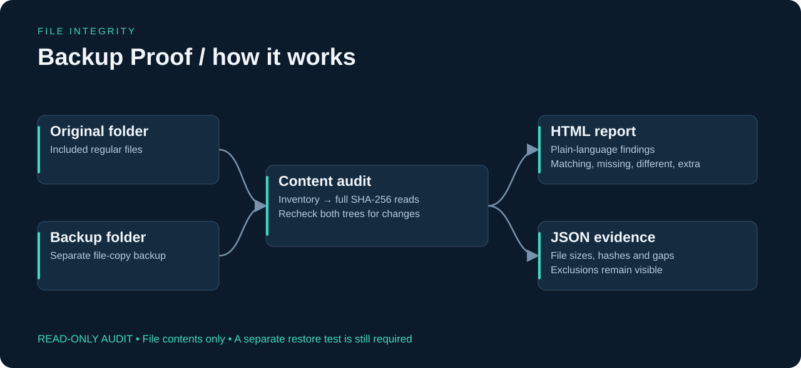
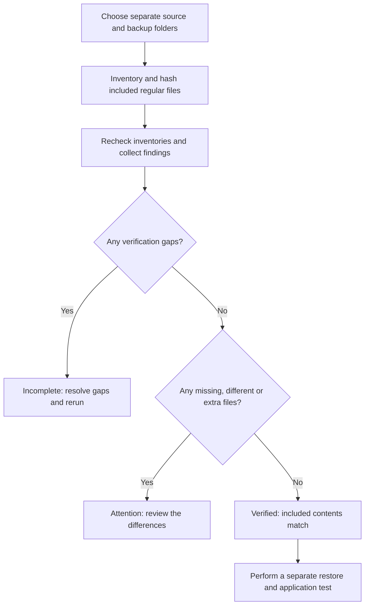
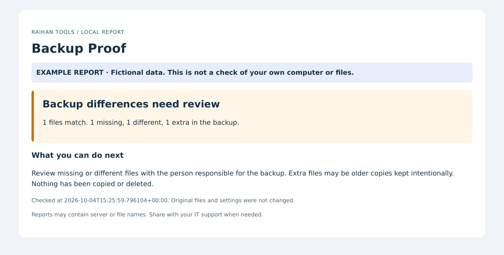
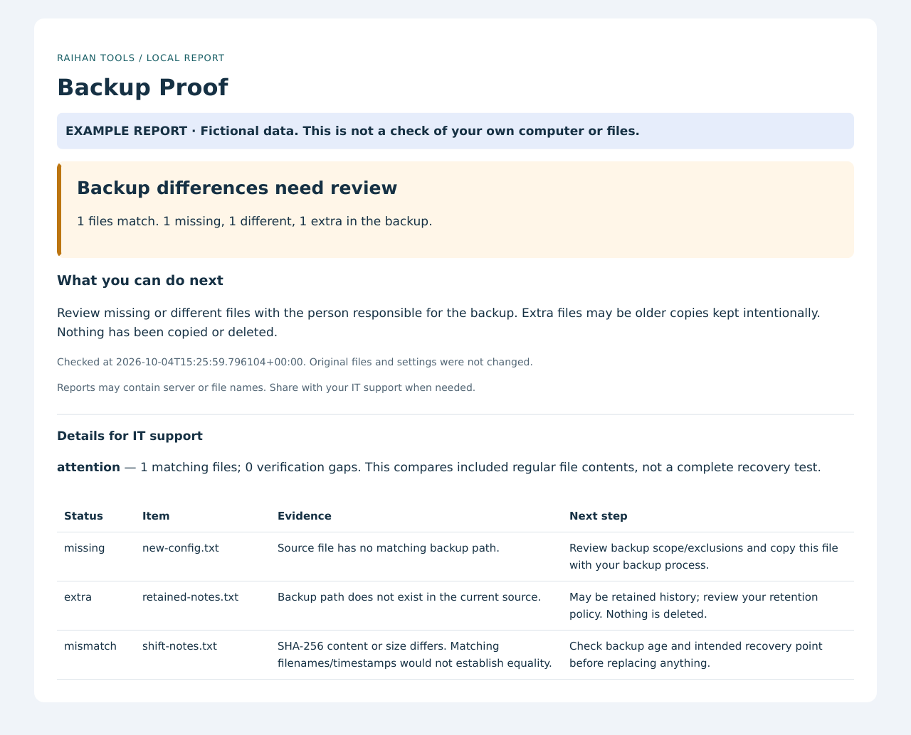

# Backup Proof — visual guide

[Back to the project](../README.md) · [Beginner steps](../START-HERE.md) · [Technical reference](TECHNICAL-REFERENCE.md)

## Follow the data



A completed backup job does not tell you whether every intended file was copied correctly. Backup Proof compares file contents and explains what needs review.

## Follow the decisions



The diagram summarizes the implementation. Error and incomplete states remain visible; a successful result applies only to the checks actually performed.

## Read an actual demo output

These images render the HTML produced by the current tool with its included fictional example data. They are report previews, not Windows desktop captures or production results. The detail image exposes the evidence table; timestamps reflect report generation or the supplied fixture.

### Plain-language overview



### Findings and suggested next steps



| Example item | Result | What you are seeing |
|---|---|---|
| inventory.txt | Matching | Source and backup contain the same file contents. |
| new-config.txt | Missing | The source path has no corresponding backup file. |
| shift-notes.txt | Different | The backup contains different contents. |
| retained-notes.txt | Extra | The backup contains a file absent from the current source; it may be retained history. |

Download and open [the complete HTML report](demo-report.html), or inspect [the exact JSON evidence](demo-report.json). GitHub displays HTML as source; the images above show its rendered content.

## Connect the diagram to the code

| File | Responsibility |
|---|---|
| [backup_proof.py](../backup_proof.py) | Inventories, hashes and compares both folder trees. |
| [desktop.py](../desktop.py) | Connects the guided desktop UI to the audit engine. |
| [report.py](../report.py) | Writes escaped HTML and machine-readable JSON evidence. |
| [tests/test_backup.py](../tests/test_backup.py) | Exercises corruption, missing files, exclusions and verification gaps. |

## What this demonstrates

Filesystem administration, backup verification, SHA-256 hashing, exception handling and evidence-based reporting.

Checks included regular file contents only. It does not validate permissions, application consistency, or recoverability. Busy files, unreadable data and other gaps prevent a complete verification.

## Reproduce these previews

Use Python 3.11+ from the repository root:

```sh
python backup_proof.py --demo --output docs/demo-report
python -m pip install -r docs/requirements-visuals.txt
python docs/render_previews.py
```

The demo intentionally returns exit code **1** because its data contains findings. That is expected. The rendering dependencies are optional documentation tools; the application itself does not need them. `render_previews.py` renders local HTML without browser access or external resources. It does not run live network checks or collect Windows settings.

The editable architecture source is [architecture.svg](images/architecture.svg); the flowchart source is [workflow.mmd](workflow.mmd).
